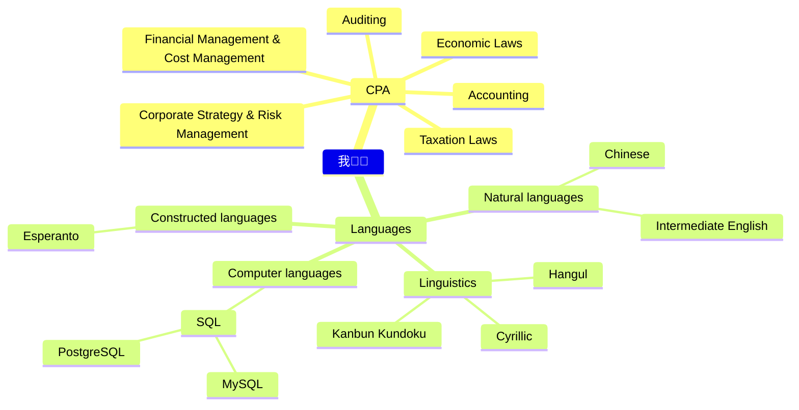
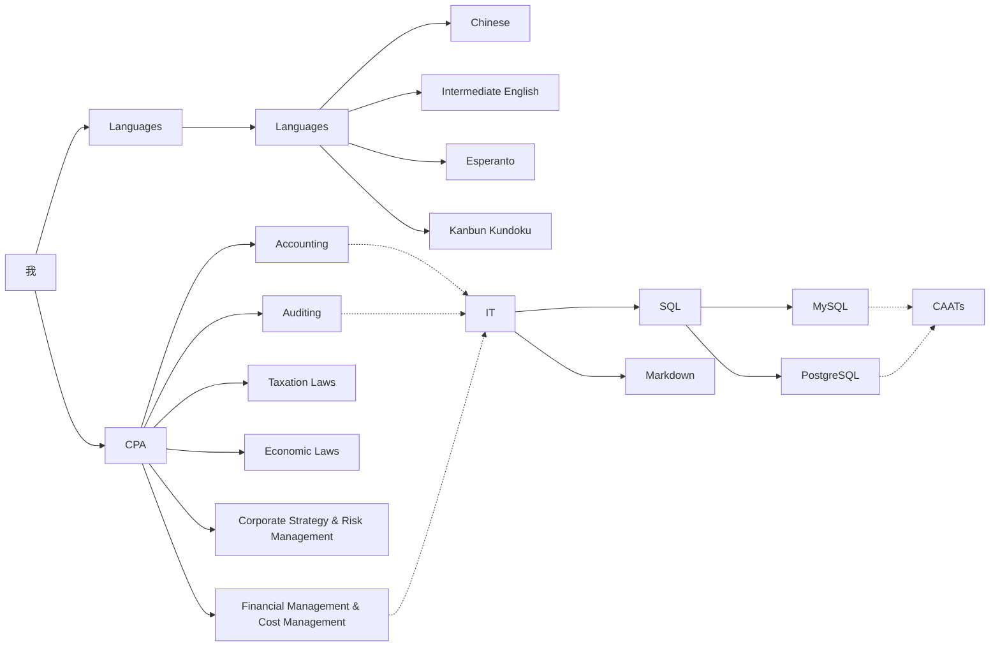

```mermaid
mindmap
  我🏳️‍⚧️
    CPA
      Accounting
      Auditing
      Financial Management & Cost Management
      Taxation Laws
      Economic Laws
      Corporate Strategy & Risk Management
    Languages
      Natural languages
        Chinese
        Intermediate English
      Constructed languages
        Esperanto
      Linguistics
        Hangul
        Cyrillic
        Kanbun Kundoku
      Computer languages
        SQL
          MySQL
          PostgreSQL
```

```mermaid
flowchart LR
    A[我] --> B[CPA]
    A --> C[Languages]
    B --> D[Accounting]
    B --> E[Auditing]
    B --> F[Financial Management & Cost Management]
    B --> G[Taxation Laws]
    B --> H[Economic Laws]
    B --> I[Corporate Strategy & Risk Management]
    C --> J[Languages]
    J --> K[Chinese]
    J --> L[Intermediate English]
    J --> M[Esperanto]
    J --> N[Kanbun Kundoku]
    D -.-> Z[IT]
    E -.-> Z[IT]
    F -.-> Z[IT]
    Z ---> Y[SQL]
    Z ---> X[Markdown]
    Y ---> V[MySQL]
    Y ---> U[PostgreSQL]
    V -.-> T[CAATs]
    U -.-> T[CAATs]
```
