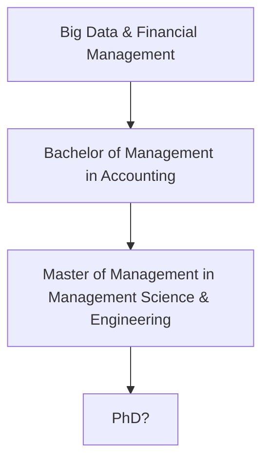

## 令和八年八月十六日

Accounting that I'm studying belongs to Management, so I'm also considering a master's degree in Management Science & Engineering.
Perhaps in the future:

*Now previewing calculus, linear algebra and probability theory & mathematical statistics...*
